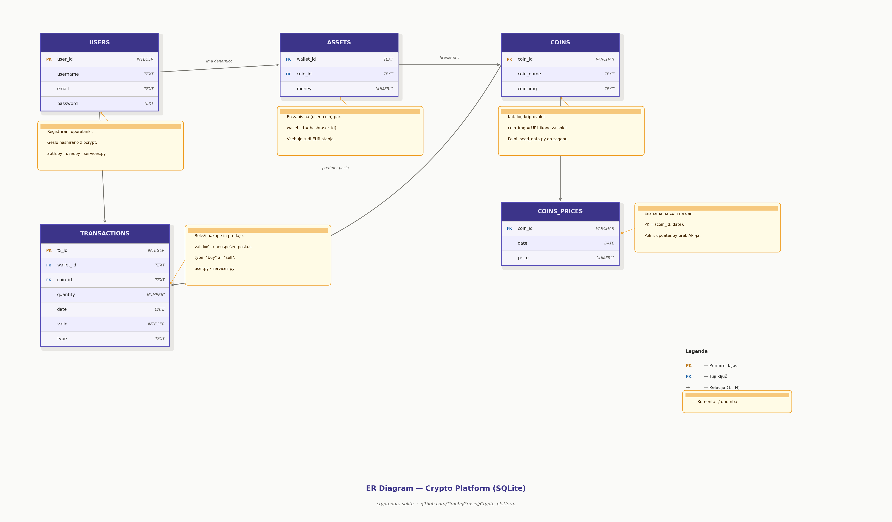

# 🪙 Crypto Platform

Simulacijska platforma za trgovanje s kriptovalutami, zgrajena v Pythonu. Uporabniki se lahko registrirajo, upravljajo z navidezno denarnico, spremljajo cene kovancev v realnem času, si ogledajo grafe cen ter izvajajo nakupe in prodaje — vse skupaj temelji na lokalni bazi SQLite, ki jo platforma sama zapolni s podatki s spleta.

Platforma je dostopna prek dveh vmesnikov: **spletne aplikacije** (ogrodje Bottle) in **ukaznega vmesnika (CLI)** v terminalu.

---

## ✨ Funkcionalnosti

- Registracija in prijava z zgoščenimi gesli
- Navidezna denarnica EUR z možnostjo polnjenja in dviga
- Samodejno dnevno posodabljanje cen kriptovalut
- Grafi zgodovine cen za vsak kovanec (matplotlib)
- Nakup in prodaja kovancev s sledenjem portfelju
- Celotna zgodovina transakcij
- Dva vmesnika: spletni (brskalnik) in CLI (terminal)
- Samodejno vzpostavljanje in zapolnjevanje baze ob prvem zagonu

---

## 📁 Struktura projekta

```
Crypto_platform/
├── app.py               # Vstopna točka spletnega vmesnika (Bottle)
├── main.py              # Vstopna točka CLI vmesnika
├── auth.py              # Avtentikacija in upravljanje gesel
├── user.py              # Model uporabnika (denarnica, trgovanje, portfelj)
├── coin.py              # Model kovanca (cene, grafi)
├── services.py          # Skupna poslovna logika (prijava, cene, grafi)
├── market_api.py        # Integracija z zunanjim API-jem za cene
├── updater.py           # Razporejevalnik posodobitev cen in preverjanje baze
├── assets.py            # Pomožne funkcije za stanje sredstev
├── crypto_utils.py      # Splošne pomožne funkcije
├── cli_inputs.py        # Pomočniki za vnos v CLI
├── create_tables.py     # Ustvarjanje sheme baze
├── seed_data.py         # Zapolnjevanje kovancev in denarnic
├── seed_users.py        # Zapolnjevanje demo uporabnikov
├── seed_transactions.py # Zapolnjevanje demo transakcij
├── views/               # HTML predloge za Bottle
├── static/              # CSS, JS, slike
└── requirements.txt
```

---

## ⚙️ Zahteve

Priporočena različica Pythona: **3.10+**

Namesti vse odvisnosti z:

```bash
pip install -r requirements.txt
```

### `requirements.txt`

```
matplotlib
bcrypt
bottle
requests
pickle
Pillow
```

| Paket        | Namen                                                  |
|--------------|--------------------------------------------------------|
| `matplotlib` | Risanje grafov zgodovine cen                          |
| `bcrypt`     | Varno zgoščevanje gesel                               |
| `bottle`     | Lahkotno spletno ogrodje za spletni vmesnik           |
| `requests`   | HTTP klici do zunanjega API-ja za cene kriptovalut    |
| `pickle`     | Odpiranje datoteke iz bitov                           |
| `Pillow`     | Shranjevanje slike kot PIL slika                      |

> Če `pip install -r requirements.txt` ne deluje, namesti ročno:
> ```bash
> pip install matplotlib bcrypt bottle requests pickle Pillow
> ```

---

## 🚀 Začetek uporabe

### 1. Kloniraj repozitorij

```bash
git clone https://github.com/TimotejGroselj/Crypto_platform.git
cd Crypto_platform
```

### 2. Namesti odvisnosti

```bash
pip install -r requirements.txt
# ali v primeru napake:
pip install matplotlib bcrypt bottle requests
```

### 3. Prvi zagon

Ob **prvem zagonu** bo platforma samodejno:
1. Ustvarila bazo SQLite (`cryptodata.sqlite`)
2. Zapolnila demo uporabnike, kovance in transakcije
3. Pridobila zgodovino cen s spleta (~2,5 minute zaradi omejitev API-ja)

**Nobenih nastavitvenih skript ni treba poganjati ročno.**

---

## 🖥️ Uporaba

### Možnost A — Spletni vmesnik

```bash
python app.py
```

Nato odpri brskalnik na naslovu:

```
http://127.0.0.1:8080
```

**Strani spletne aplikacije:**

| Pot                | Opis                                          |
|--------------------|-----------------------------------------------|
| `/`                | Stran za prijavo (ali napredek namestitve)    |
| `/register`        | Ustvarjanje novega računa                     |
| `/dashboard`       | Pregled vseh kovancev in cen                  |
| `/account`         | Tvoj portfelj, stanja in zgodovina            |
| `/coin/<coin_id>`  | Stran kovanca z grafom in možnostjo trgovanja |

---

### Možnost B — CLI vmesnik

```bash
python main.py
```

Po menijih se pomikaj z vnosom številke ob vsaki možnosti.

**Razpoložljive akcije:**

```
1. Oglej si današnje cene
2. Oglej si graf cen
3. Oglej si portfelj
4. Oglej si tržni obseg kovanca
5. Polagaj sredstva
6. Dvigni sredstva
7. Trguj s kriptovalutami
8. Izhod
```

---

## 📊 Kako deluje

### Podatki o cenah
Cene kovancev se pridobivajo iz zunanjega API-ja. Za vsak kovanec se shrani ena cena na dan. Ob zagonu sistem preveri, ali današnja cena že obstaja — če ne, jo samodejno posodobi.

### Trgovanje
Posli so odstotkovno zasnovani: pri nakupu sistem izračuna strošek v EUR; pri prodaji izračuna delež imetja za prodajo. Vsi posli se zabeležijo v zgodovino transakcij.

### Avtentikacija
Gesla so zgoščena z `bcrypt`. Seje za spletni vmesnik so shranjene v pomnilniku strežnika in upravljane prek piškotkov.

---

## 🗄️ Baza podatkov

Platforma uporablja **SQLite** (`cryptodata.sqlite`), ki se samodejno ustvari ob prvem zagonu. Nobena ročna konfiguracija baze ni potrebna. Spodaj je diagram ER, ki prikazuje strukturo tabel.



---

## 👥 Avtorja

- Timotej Groselj
- Jaka Perbil
